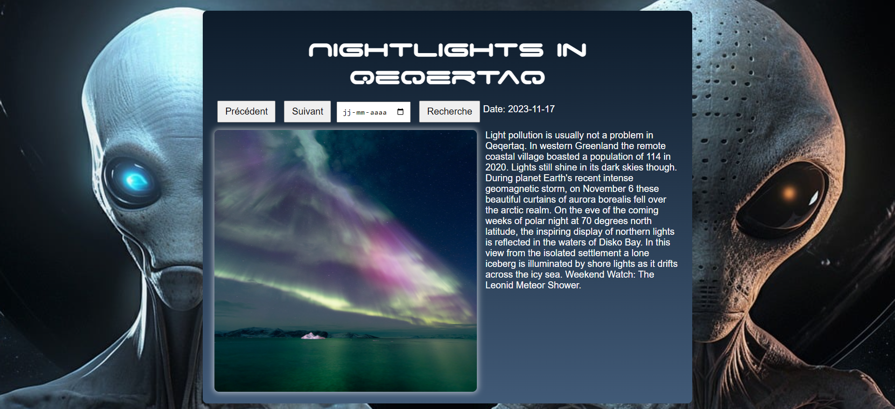

# API NASA :rocket:

## Description

Bienvenue dans l'API NASA! Ce projet vous permet d'explorer une image différente de la NASA chaque jour. Vous pouvez revenir à des dates spécifiques, comme votre anniversaire, pour voir quelle photo a été publiée ce jour-là. Chaque image est accompagnée d'une explication. :book:

## Aperçu :camera:

Accéder au site en direct en cliquant [ici](https://zanko19.github.io/api-nasa/)

## Technologies Utilisées :gear:

Ce projet utilise la technologie suivante :

- [Nasa API](https://api.nasa.gov/)

## Développement en Local :computer:

Pour lancer le projet localement sur votre machine, suivez ces étapes :

1. Clonez ce dépôt : `git clone https://github.com/Zanko19/api-nasa.git`
2. Accédez au répertoire du projet : `cd api-nasa`
3. Installez les dépendances : `npm install` (ou `yarn install` si vous utilisez Yarn)
4. Lancez le projet : `npm start` (ou `yarn start`)

Assurez-vous d'avoir [Node.js](https://nodejs.org/) installé sur votre machine.

## Problèmes Connus :warning:

Pas vraiment de gros soucis cette fois, en tout cas rien que je n'ai pas pu régler tout seul.

## © Guillaume Dedeurwaerder © 
### :calendar: 17/11/2023

